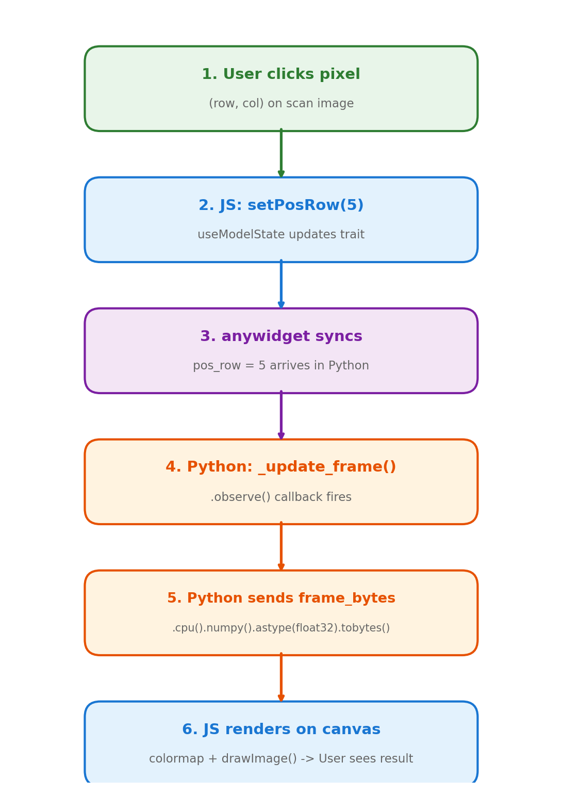
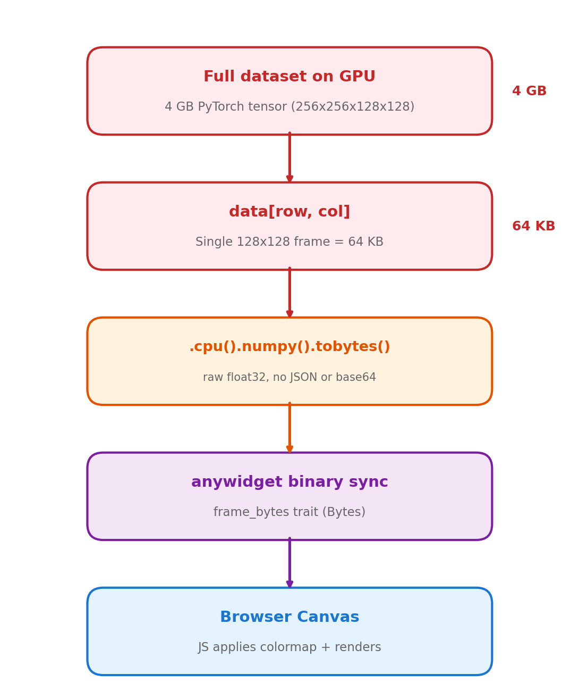

# Getting Started

## Setup

You need Python 3.11+, Node.js 20+, and the `quantem` core library.


### Option A: conda (recommended)

```bash
conda create -n widget python=3.12 nodejs=20 -y
conda activate widget
pip install quantem

git clone https://github.com/bobleesj/quantem.widget.git
cd quantem.widget
npm install
npm run build
pip install -e .
```

### Option B: uv

```bash
git clone https://github.com/bobleesj/quantem.widget.git
cd quantem.widget
npm install
npm run build
uv sync
```

> **Note:** With `uv`, prefix Python commands with `uv run`, or activate with
> `source .venv/bin/activate`.


### Verify

```bash
python -c "from quantem.widget import Show2D; print('OK')"
```


## Making changes

### JavaScript (layout, rendering, UI)

1. `npm run dev` — watch mode, rebuilds on save
2. Set `%env ANYWIDGET_HMR=1` in the notebook for live reload without re-running cells
3. Edit `js/<widget>/index.tsx`
4. Re-run the notebook cell (or let HMR pick it up automatically)

### Python (data processing, observers)

1. `pip install -e .` — once
2. Edit `src/quantem/widget/<widget>.py`
3. **Restart the kernel** and re-run cells.


## Code organization

Each widget is exactly **one Python file** + **one TSX folder**. No inheritance
hierarchy — each widget is self-contained.

```
quantem.widget/
├── js/                          # TypeScript/React source
│   ├── align2d/index.tsx        # One folder per widget (each is self-contained)
│   ├── bin/index.tsx
│   ├── edit2d/index.tsx
│   ├── mark2d/index.tsx
│   ├── merge4dstem/index.tsx
│   ├── show1d/index.tsx
│   ├── show2d/index.tsx
│   ├── show3d/index.tsx
│   ├── show3dvolume/index.tsx
│   ├── show4d/index.tsx
│   ├── show4dstem/index.tsx
│   ├── showcomplex/index.tsx
│   ├── colormaps.ts             # ── Shared JS (used by all widgets) ──
│   ├── format.ts                #   Data extraction, number formatting
│   ├── histogram.ts             #   Histogram computation
│   ├── scalebar.ts              #   Scale bar, colorbar, figure export
│   ├── stats.ts                 #   Data statistics, log scale, clipping
│   ├── theme.ts                 #   Light/dark theme detection
│   ├── tool-parity.ts           #   Tool lock/hide logic
│   └── webgpu-fft.ts            #   GPU-accelerated FFT with CPU fallback
├── src/quantem/widget/          # Python source
│   ├── align2d.py               # One file per widget
│   ├── bin.py
│   ├── edit2d.py
│   ├── mark2d.py
│   ├── merge4dstem.py
│   ├── show1d.py
│   ├── show2d.py
│   ├── show3d.py
│   ├── show3dvolume.py
│   ├── show4d.py
│   ├── show4dstem.py
│   ├── showcomplex.py
│   ├── array_utils.py           # ── Shared Python (used by all widgets) ──
│   ├── json_state.py            #   State save/load envelope format
│   ├── tool_parity.py           #   Tool lock/hide validation
│   └── static/                  # Built JS bundles (generated by npm run build)
├── tests/                       # pytest unit tests + Playwright E2E tests
├── docs/                        # Sphinx documentation
├── notebooks/                   # Development/testing notebooks
├── package.json                 # esbuild config, npm scripts
└── pyproject.toml               # Python package config
```

Finding code is simple: `Show4DSTEM`'s Python is `src/quantem/widget/show4dstem.py`,
its frontend is `js/show4dstem/index.tsx`.


## Shared modules

Each widget is self-contained, but a small set of utility modules are shared
across **all** widgets. These exist because every widget needs them — they passed
the bar of "used by 12+ widgets" before being extracted.

**Python** (`src/quantem/widget/`):
- `array_utils.py` — `to_numpy()` converts any input (NumPy, PyTorch, CuPy) to NumPy. Used by all 12 widgets.
- `json_state.py` — `save_state_file()` and `unwrap_state_payload()` for the versioned JSON state envelope. Used by all 12 widgets.
- `tool_parity.py` — validates `disabled_tools` / `hidden_tools` keys. Used by 11 widgets.

**JavaScript** (`js/`):
- `theme.ts` — `useTheme()` hook for automatic light/dark mode. Used by all 12 widgets.
- `colormaps.ts` — colormap LUTs and `applyColormap()`. Used by all image widgets.
- `format.ts` — `extractFloat32()`, `formatNumber()`, `downloadBlob()`. Used by all widgets.
- `stats.ts` — `computeStats()`, `percentileClip()`, `applyLogScale()`. Used by all image widgets.
- `scalebar.ts` — `drawScaleBarHiDPI()`, `exportFigure()`. Used by all canvas widgets with calibration.
- `histogram.ts` — `computeHistogramFromBytes()`. Used by all image widgets.
- `webgpu-fft.ts` — GPU-accelerated 2D FFT with CPU fallback. Used by all FFT-capable widgets.
- `tool-parity.ts` — tool lock/hide state management. Used by 11 widgets.

Do not create new shared modules unless the logic is already duplicated across
many widgets. When in doubt, keep it in the widget file and extract later.


## Python ↔ JavaScript bridge

`anywidget` bridges the two sides. You declare **traitlets** in Python, and they
automatically sync to React state in the browser.



### Python declares traitlets

Every trait marked `.tag(sync=True)` is visible to both Python and JavaScript:

```python
class Show4DSTEM(anywidget.AnyWidget):
    pos_row = traitlets.Int(0).tag(sync=True)          # scalar → number
    frame_bytes = traitlets.Bytes(b"").tag(sync=True)   # binary → DataView
```

### JavaScript reads and writes traitlets

`useModelState()` works like `useState` but the value is synced to Python:

```tsx
const [posRow, setPosRow] = useModelState<number>("pos_row");
const [frameBytes] = useModelState<DataView>("frame_bytes");  // read-only
```

Calling `setPosRow(5)` in JavaScript sets `pos_row = 5` on the Python object.

### Python reacts to changes

`.observe()` registers callbacks that fire when a trait changes:

```python
self.observe(self._update_frame, names=["pos_row", "pos_col"])
```

### The full cycle

When a user clicks a position on the scan image:

1. **JS**: user clicks → `setPosRow(5)` fires
2. **Python**: `.observe()` triggers `_update_frame()`
3. **Python**: extracts the frame, sets `self.frame_bytes = ...`
4. **JS**: receives new `DataView`, re-renders the canvas

This round-trip happens in milliseconds.

### Trait types

| Python type | JS type | Example use |
|---|---|---|
| `traitlets.Int` | `number` | Position, shape, indices |
| `traitlets.Float` | `number` | Calibration, ROI params |
| `traitlets.Bool` | `boolean` | Toggles (log scale, ROI active) |
| `traitlets.Unicode` | `string` | Mode selection, titles |
| `traitlets.Bytes` | `DataView` | Image data (raw float32) |
| `traitlets.List` | `Array` | Compound updates, statistics |


## Data flow: GPU to browser

The full dataset (potentially 16+ GB) stays on GPU or CPU as a PyTorch tensor.
On each user interaction, Python extracts a **single frame** (~64 KB), serializes
it as raw bytes, and sends it to the browser. The browser does colormapping and
rendering entirely in JavaScript.



**A 16 GB dataset lives on GPU, but only 64 KB crosses the wire per click.**


## Widget catalog

| Widget | Description | GPU |
|---|---|---|
| `Show1D` | 1D trace viewer with multi-trace overlay, crosshair, legend | No |
| `Show2D` | 2D image viewer with gallery, ROI, line profiles, FFT, export | No |
| `Show3D` | 3D stack viewer with playback, ROI, FFT, export | No |
| `Show3DVolume` | Orthogonal slice viewer (XY, XZ, YZ) with FFT, playback | No |
| `Show4D` | General 4D dataset explorer with nav + signal panels, ROI masking | Yes |
| `Show4DSTEM` | 4D-STEM diffraction viewer with virtual imaging, ROI presets | Yes |
| `ShowComplex2D` | Complex-valued 2D viewer (amplitude/phase/HSV/real/imag) | No |
| `Mark2D` | Interactive 2D annotation (points, ROIs, profiles, snap-to-peak) | No |
| `Edit2D` | Interactive crop/pad/mask editor with brush tool | No |
| `Align2D` | Image alignment overlay with FFT-based auto-align | No |
| `Bin` | Detector binning with live preview and batch export | Yes |
| `Merge4DSTEM` | 4D-STEM sector merging with alignment and stitching | Yes |
